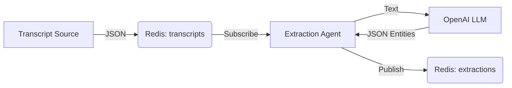

# Extraction Agent

This agent is a simplified, fast extraction service designed for a travel booking system. It listens to transcript segments from a conversation stream, extracts relevant travel entities using an LLM, and publishes the results for downstream processing.

## Overview

The Extraction Agent operates as a background service that:
1.  **Listens** to a Redis Pub/Sub channel for new transcript segments.
2.  **Processes** the text using OpenAI's GPT model to identify travel-related information.
3.  **Publishes** the raw extracted data back to a different Redis channel.

## Features

*   **Real-time Processing**: Designed to handle 20-second transcript segments asynchronously.
*   **Entity Extraction**: Identifies dates, budgets, traveler counts, locations, activities, preferences, and customer tone.
*   **Event-Driven**: Fully decoupled architecture using Redis Pub/Sub.
*   **Structured Output**: Returns data in a standardized JSON format wrapped in Pydantic models.

## Architecture

### Data Flow



### Input (`TranscriptSegment`)
The agent expects messages on the `transcripts` topic with the following structure:
- `segment_id`: Unique ID for the segment.
- `timestamp`: Time of the segment.
- `speaker`: Who is speaking ("customer" or "agent").
- `text`: The actual speech text.

### Output (`RawExtraction`)
The agent publishes to the `extractions` topic:
- `extraction_id`: Unique ID for the extraction event.
- `segment_id`: Reference to the original input.
- `entities`: Dictionary containing extracted data (dates, budget, locations, etc.).
- `processing_time_ms`: Time taken to process.

## Configuration

The agent is configured via `Config.py` and environment variables:

| Variable | Description | Default |
|----------|-------------|---------|
| `OPENAI_API_KEY` | API Key for OpenAI | *Required* |
| `REDIS_URL` | Connection string for Redis | `redis://localhost:6379` |
| `LLM_MODEL` | Model to use | `gpt-4-turbo` |

## Usage

1.  **Prerequisites**:
    *   Python 3.8+
    *   Redis Server running
    *   OpenAI API Key

2.  **Install Dependencies**:
    ```bash
    pip install openai redis pydantic
    ```

3.  **Run the Agent**:
    ```bash
    python agent.py
    ```

## Extraction Logic

The agent uses a specialized system prompt to extract the following categories:
- **Dates**: Time mentions.
- **Numbers**: Budgets, people counts, ages.
- **Locations**: Countries, cities, sites.
- **Activities**: Desired activities.
- **Preferences**: Hotel types, food, pace.
- **Tone**: Customer sentiment (e.g., excited, worried).
