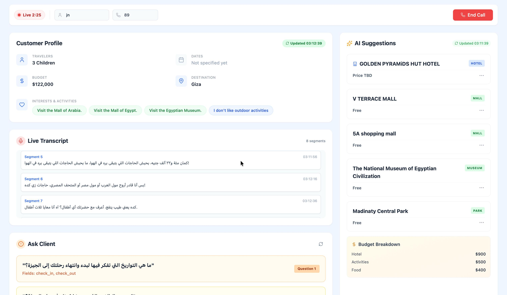
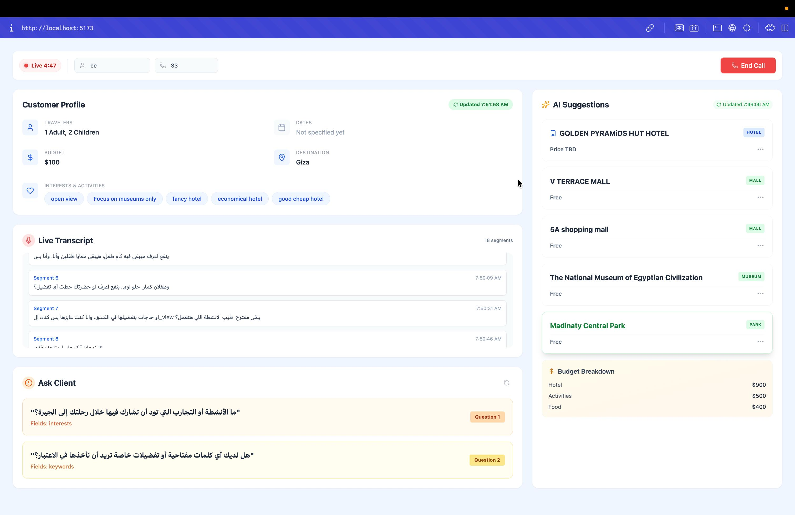
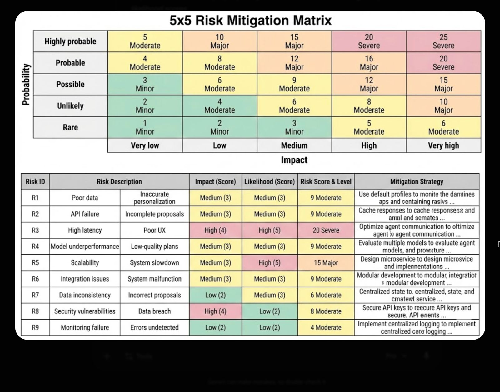

# Real-Time Multi-Agent System for Travel Personalization & Proposal Generation

A real-time, multi-agent AI system that listens to a live travel-agent ↔ customer phone call, transcribes it as it happens, extracts the customer's travel requirements on the fly, builds an evolving customer profile, and generates a personalized travel proposal (hotel + day-by-day itinerary + budget breakdown) — all streamed back to a live agent dashboard.

The system is designed for **travel call-centers**: while the human agent talks to the customer, the platform silently does the "note-taking", requirement-gathering, and package-building in the background, and even suggests follow-up questions the agent should ask to complete the customer's profile.

---

## 📸 Live Agent Dashboard

While the call is live, the agent sees the customer profile fill in, the transcript stream, AI-generated package suggestions, and follow-up questions to ask — all updating in real time.



The **Ask Client** panel surfaces the exact questions (and the profile fields they fill) the agent should ask to complete the customer's requirements, alongside a live budget breakdown.



---

## ✨ What It Does

1. **Listens** – Streams audio from the browser (microphone) to the backend over a WebSocket.
2. **Transcribes** – Converts speech to text in near real-time using a SeamlessM4T ASR pipeline with LLM-based post-correction.
3. **Extracts** – An LLM extraction agent pulls structured travel entities (budget, dates, city, travelers, rooms, activities, preferences) from each transcript segment.
4. **Profiles** – A profile agent tracks what's known vs. missing and generates smart follow-up questions for the agent to ask.
5. **Recommends** – A recommendation engine + planning agent produces a complete travel proposal: a matched hotel, a day-by-day itinerary of activities, and a budget breakdown.
6. **Displays** – Everything (transcript, live profile, suggested questions, recommendations) streams to a React dashboard in real time.

---

## 🧠 Multi-Agent Architecture

The system is composed of cooperating, specialized agents orchestrated per-call:

| Agent / Component | Responsibility |
|---|---|
| **ASR Pipeline** (`TranscriptionService`) | Chunked, streaming speech-to-text with overlap handling, confidence scoring, and LLM post-correction of the raw transcript. |
| **Extraction Agent** | Uses a schema-constrained LLM to turn each transcript segment into a validated `Agent_output` (budget, adults, children, rooms, city, check-in/out, activities, preferences, keywords). Persists and incrementally updates the extraction per call. |
| **Profile Agent** | Reads accumulated extraction data and generates targeted questions (with the fields each question would fill) to complete the customer profile. |
| **Recommendation Engine** | Hotel recommender + activity recommender that match against a knowledge base of Cairo/Giza hotels, museums, parks, malls, and cafes. |
| **Planning Agent** | Distributes the budget and assembles the final day-by-day travel plan (hotel + itinerary + budget breakdown). |
| **Orchestrator** | Merges each new extraction into a running profile using field-level merge rules (append / overwrite / ignore), then re-runs recommendations after every segment. |

### Data Flow

```
🎙️ Browser Mic
     │  (WebM audio chunks, base64 over WebSocket)
     ▼
🔌 FastAPI WebSocket  ──►  ffmpeg (WebM → 16kHz mono WAV)
     ▼
🗣️ ASR Pipeline (SeamlessM4T + LLM correction)  ──►  transcript segment
     ▼
🧩 Extraction Agent (LLM, schema-validated)  ──►  structured entities  ──►  PostgreSQL
     ▼
🧑 Profile Agent  ──►  follow-up questions
     ▼
🔀 Orchestrator (field merge rules)  ──►  running user profile
     ▼
🏨 Recommendation Engine + 🗺️ Planning Agent  ──►  hotel + itinerary + budget
     ▼
📊 React Dashboard (live transcript, profile, questions, proposal)
```

---

## 🛠️ Tech Stack

**Backend**
- **Python 3.13**, **FastAPI**, **Uvicorn** — async API + WebSocket streaming server
- **SQLAlchemy 2.0 (async)** + **asyncpg** — persistence layer over a **Neon / PostgreSQL** database
- **Pydantic 2** — schema-validated agent outputs and API models
- **Ollama** (local + cloud) — LLM inference for extraction, profiling, and ASR correction (structured/JSON-schema-constrained generation)

**AI / ML**
- **SeamlessM4T v2**  speech-to-text ASR
- **PyTorch / torchaudio / torchcodec**, **librosa**, **soundfile**, **numpy** — audio processing
- **LangSmith** — tracing/observability of agents and the ASR pipeline

**Data & Recommendation KB**
- **pandas** + **openpyxl** — Excel-based knowledge base (hotels, museums, parks, malls, cafes)
- **Playwright** — hotel data scraping
- **DVC** — data versioning for the KB datasets
- **Redis** — caching

**Frontend**
- **React 19** + **Vite** (rolldown-vite)
- **Tailwind CSS**
- **lucide-react** — icons
- Native **MediaRecorder** + **WebSocket** for live audio capture and streaming

**Infra / Ops**
- **Docker** — single-image build serving both the built frontend and the backend
- **ffmpeg** — audio format conversion (WebM/Opus → WAV)
- **uv** — Python dependency management
- Structured **JSON logging** (MLOps-style) across the recommendation and planning agents

---

## 📁 Project Structure

```
.
├── main.py                         # CLI orchestrator (file-based, end-to-end demo run)
├── Dockerfile                      # Builds frontend + backend into one image
├── requirements.txt
├── backend/
│   ├── api/app.py                  # FastAPI app: WebSocket stream + profile-questions REST endpoint
│   ├── core/
│   │   ├── llm.py                  # Ollama local + cloud LLM clients (structured output)
│   │   ├── tracing_config.py       # LangSmith tracing setup
│   │   ├── ASR/                    # Streaming speech-to-text pipeline (SeamlessM4T)
│   │   ├── extraction_agent/       # LLM entity extraction + Pydantic schema
│   │   ├── profile_agent/          # Follow-up question generation
│   │   ├── recommendation_engine/  # Hotel + activity recommenders, planner, orchestrator, scraping
│   │   └── prompts/                # YAML prompt templates + loader
│   └── database/                   # Async SQLAlchemy models, repositories, Neon connection
├── frontend/                       # React + Vite + Tailwind live dashboard
└── data/                           # DVC-tracked KB datasets + result artifacts
```

---

## 🚀 Getting Started

### Prerequisites
- Python 3.13, Node.js 20+
- `ffmpeg` installed and on `PATH`
- Access to an **Ollama** endpoint (local and/or cloud) and a **PostgreSQL/Neon** database
- (Optional) LangSmith account for tracing

### Environment

Create a `.env` file in the project root:

```env
# LLM (Ollama)
OLLAMA_API_KEY=...
OLLAMA_BASE_URL=https://ollama.com
MODEL_NAME=...              # ASR model (SeamlessM4T)
CORRECTION_MODEL=...

# ASR / audio
DEVICE=cpu
CHUNK_LENGTH=...
OVERLAP=...
TARGET_SR=16000
cache_dir=...

# Database & cache
DATABASE_URL=postgresql://...   # Neon / Postgres
REDIS_URL=...

# Tracing
LANGSMITH_TRACING_V2=true
LANGSMITH_API_KEY=...
LANGSMITH_PROJECT=multi-agent-travel-recommendation-engine
```

### Run with Docker (recommended)

```bash
docker build -t travel-personalization .
docker run --env-file .env -p 8000:8000 -p 3000:3000 travel-personalization
```

- Backend API + WebSocket: `http://localhost:8000`
- Frontend dashboard: `http://localhost:3000`

### Run locally (dev)

Backend:
```bash
pip install -r requirements.txt
python -m backend.api.app        # serves on :8000
```

Frontend:
```bash
cd frontend
npm install
npm run dev                      # Vite dev server
```

### End-to-end demo from an audio file

`main.py` runs the full pipeline against a `.wav` file (no browser needed) — useful for testing the agents end-to-end:

```bash
python main.py
```

---

## 🔌 API

**REST**
- `GET /` — service status and endpoint listing
- `GET /health` — health check (used by the Docker `HEALTHCHECK`)
- `POST /api/profile/questions/{call_id}` — generate follow-up profile questions for a call

**WebSocket** — `ws://localhost:8000/ws/stream`

Message types (client → server):
- `start_call` — begin a session (`clientName`, `clientPhone`); creates a call record
- `audio_segment` — base64 WebM/Opus audio chunk to transcribe
- `stop` — end the call

Message types (server → client):
- `call_started`, `transcript`, `extraction_done`, `recommendations`, `error`

---

## 🧾 Extracted Profile Schema

Each transcript segment is distilled into a validated structure:

```python
budget: float
adults: int
children: int
children_age: list[int]
rooms: int
city: "Cairo" | "Giza"
check_in: str        # ISO date
check_out: str       # ISO date
activities: list[str]
preferences: list[str]
keywords: list[str]
```

These fields accumulate across the call via field-level merge rules (e.g. `activities` append, `adults` overwrite, `budget`/`city`/dates keep first value) to form the profile fed to the recommendation and planning agents.

---

## ⚠️ Risk Assessment & Mitigation

Key operational risks for a real-time, multi-agent, LLM-driven pipeline were scored on a 5×5 impact/likelihood matrix, each with a mitigation strategy (e.g. caching for API failures, agent-to-agent optimization for latency, multi-model evaluation for underperformance, centralized state for data consistency, and centralized logging for monitoring).



---

## 📄 License

See [LICENSE](LICENSE).
